<h1 align="center">👋 Hi, I'm Vatsal Garg</h1>

  

<h3><code>vatsal@github ~ $ ./contributions.sh</code></h3>

  

<h3><code>vatsal@github ~ $ whoami</code></h3>

  

---

<h3><code>vatsal@github ~ $ cat bio.txt</code></h3>

> With a strong aptitude for independent research and quick learning, I am deeply interested in national security and motivated to move beyond theoretical knowledge to help protect India's critical digital infrastructure. I am seeking a challenging remote internship to apply my problem-solving skills to real-world threats and contribute to a mission-driven team.

 

<h3><code>vatsal@github ~ $ cat links.json</code></h3>

<pre>
{
  "projects": "<a href="https://github.com/vatsalgargg" target="_blank">github.com/vatsalgargg</a>",
  "portfolio": "<a href="https://vatsal.works" target="_blank">vatsal.works</a>",
  "tryhackme": "<a href="https://tryhackme.com/p/mrR0bOt" target="_blank">tryhackme.com/p/mrR0bOt</a>"
}
</pre>

 

---

<h3><code>vatsal@github ~ $ cat open-source.md</code></h3>

Active contributor to enterprise-grade security and OSINT tools, focusing on logic patching, false-positive reduction, and feature implementation.

| Project | Contribution | Impact | PR |
| :--- | :--- | :--- | :--- |
| **[Nuclei Templates](https://github.com/projectdiscovery/nuclei-templates)** | Patched Laravel-Env Scanner (False Positive Reduction) | Implemented HTTP header validation to eliminate soft-404 false positives, improving the scanner's accuracy for identifying exposed credentials. | [🔗 #15598](https://github.com/projectdiscovery/nuclei-templates/pull/15598) |
| **[Sherlock](https://github.com/sherlock-project/sherlock)** | Restored LinkedIn Username Detection | Fixed a parsing bug in the data entry logic, ensuring accurate OSINT resolution for LinkedIn profiles globally. | [🔗 Link](https://github.com/sherlock-project/sherlock/pull/2824) |
| **[OpenClaw](https://github.com/openclaw/openclaw)** | Fixed Browser CDP Worker Lifecycle | Fixed a resource leak by ensuring attached browser workers exit cleanly after CDP adapter usage, improving process management and reliability. | [🔗 #122103](https://github.com/openclaw/openclaw/pull/122103) |

 

---

<h3><code>vatsal@github ~ $ ./show-skills.sh</code></h3>

  
  
  
  
  
  
  

 

---

<h3><code>vatsal@github ~ $ ./connect.sh</code></h3>

  
  &nbsp;&nbsp;
  

  

